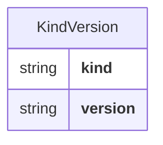
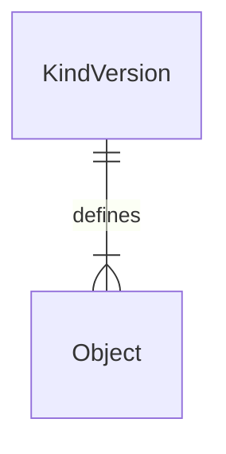
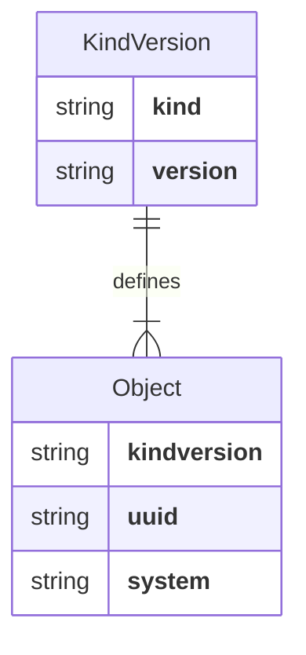
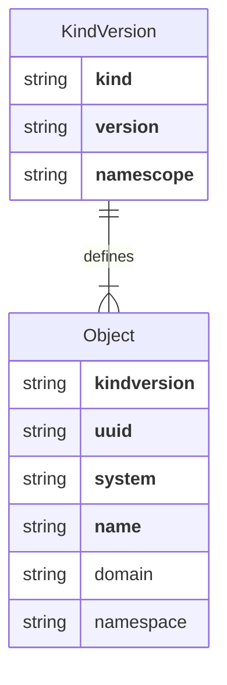

# `rxp` - Reliable eXecution Primitives

`rxp` is a Go library providing low-level interfaces and primitives required by
Reliable Execution platforms.

## Design principles

* Well-documented code and plenty of example code

  The code itself should be well-documented with lots of usage examples.

* Interfaces should be consistent across modules

  Each module in the library should be structured in a consistent fashion, and
  the structs returned by various library functions should have consistent
  attribute and method names.

* Just the right amount of abstraction

  Developers should not need to wade through needless layers of abstraction to
  properly use the library. Interfaces should be small, with a minimal surface
  area driven by the consumer/caller of the interface's methods. No
  "AbstractFactoryBuilder" Java-esque stuff.

* Safety first, performance second

  The focus on the library should be on enforcing the safety and durability
  constraints that a Reliable Execution platform requires, not on raw
  performance. Performance optimization should come only after safety is
  guaranteed.

* Design for small to large scale

  The library should be capable of handling small (less than 10GB) to large
  (greater than 100TB) active data set sizes without rearchitecting.
  This means that structures managed by the library are designed to be
  partition-aware and advertise [name uniqueness constraints][#namescope].

## Introduction

`rxp` provides building blocks used to construct a Reliable Execution platform.

This source code repository contains the core `rxp` library. There are separate
source code repositories for `rxp` backend implementations -- for example, the
[`rxp-pg`][rxp-pg] repository contains the `rxp` implementation using
PostgreSQL as the primary persistence store.

At its core, a Reliable Execution platform must be able to:

* Guarantee uniqueness of names within some scope
* Safely evolve the definition of a thing
* Safely mutate desired state of a thing
* Provide auditability for managed things

[rxp-pg]: https://github.com/relexec/rxp-pg

### Name uniqueness

All things managed by `rxp` have a *name*.

A thing's name is a special attribute.

Because names are easier to remember than globally-unique string identifiers
like UUIDs, things are often looked up by their name. This is why names must be
treated with care by the system.

Human-readable names for various things in the `rxp` system are guaranteed to
be unique within a particular [`Namescope`][#namescope].

#### Renaming

Humans change their mind, sometimes often. Because of this, the ability to
rename something is a critical piece of functionality for long-lived systems.

`rxp` treats the action of renaming something as a special operation. When a
thing is renamed, `rxp` guarantees that the renaming of done in a safe, audited
and complete fashion.

### Safe evolution of definitions

### Safe mutation of desired state

### Auditability

## Taxonomy

Data managed by `rxp` is uniformly organized in a common taxonomy.

Briefly, a `KindVersion` uniquely identifies a *type and version* of a thing
that is managed by `rxp`.

An `Object` is an *instance* of a `KindVersion`.

`Objects` *always* have a [`System`][#system] identifier. System identifiers
are globally-unique.

`Objects` *always* have a UUID globally-unique identifier.

`Objects` *always* have a Name. An `Object`'s Name is unique within the
[`Namescope`][#namescope] associated with the `KindVersion`.

If that `Namescope` is `NamescopeNamespace` or `NamescopeDomain`, the `Object`
is guaranteed to have a [`Domain`][#domain]. If that `Namescope` is
`NamescopeNamespace`, the `Object` is guaranteed to have a `Namespace`.

`Objects` *may* have zero or more `Labels` associated with them. `Labels` are
structures with a `Key` and optional `Value` that can be used to categorize
`Objects`.

## Reference

### Library structure

The [`types`][pkg-rxptypes] package contains interfaces and type definitions
referenced throughout the `rxp` library and associated `rxp` backend
implementations.

[pkg-rxptypes]: https://github.com/relexec/rxp/tree/main/types

### `System`

`System` represents the boundaries of an `rxp` system installation.

### `Domain`

`Domain` is a specialized string containing a top-level division or partition
of things managed by `rxp`.

A valid `Domain` is a DNS-formatted (RFC 1035-compliant) name less than 254
characters.

A `Domain` must be unique within the scope of the `rxp` system installation.

### `Namespace`

`Namespace` describes a logical division within a `Domain`.

A `Namespace` is typically used to segregate data by tenancy boundaries.

A valid `Namespace` is a DNS-formatted (RFC 1035-compliant) name.

Note that unlike RFC 1035, there is no 253 character size limit on `Namespace`
string length.

A `Namespace` must be unique within its containing `Domain`.

### `Kind`

`Kind` is a specialized string containing the *type* of an `Object`.

A valid `Kind` is a DNS-formatted (RFC 1035-compliant) name of the type of
`Object`, e.g.  `flow.temporal.io`.

Conventionally, a `Kind` is specified as a singular, not plural, noun. So,
`flow`, not `flows`.

Furthermore, a `Kind` is conventionally all lower-cased, with dots separating
coarser-grained categories/groups. So, `flow.temporal.io`, not
`TemporalFlow`.

You can use only alphanumeric characters and hyphens in the `Kind` name parts,
separated by periods. Furthermore, the first character of the `Kind` must be a
letter or number, not a hyphen or period.

> Note that unlike RFC 1035, there is no 253 character size limit on the
> `Kind` string length.

A `Kind` must be unique within the scope of the `rxp` system installation,
however for any `Kind` that is intended to be used across multiple `rxp` system
installations, the `Kind` should be globally-unique.

### `KindVersion`

`KindVersion` is a specialized string that contains the `Kind` and optionally a
SemVer version string that uniquely identifies the exact type of an `Object`.

A `KindVersion` string has the format `<kind>[@<version>]`, where `<kind>` is a
valid `Kind` and the optional `<version>` component must be a valid SemVer
version string.

> Note that a valid SemVer version string does *not* contain a `v` prefix.

### `Namescope`

`Namescope` refers to the uniqueness constraint applied to the name of some
thing managed by `rxp`.

There are five `Namescope` values, listed here in order of specificity, from
the narrowest to broadest specificity.

* `NamescopeNamespace`: name is unique within the scope of the `Object`'s
  `Kind`, `Domain`, and `Namespace`.
* `NamescopeDomain`: name is unique within the scope of the `Object`'s `Kind`
  and `Domain`.
* `NamescopeKind`: name is unique within the scope of the `Object`'s `Kind`.
* `NamescopeSystem`: name is unique within the scope of the `rxp` system
  installation
* `NamescopeGlobal`: name is globally-unique.

### `Object`

`Object` describes an instance of something whose lifecycle is controlled by
`rxp`.

An `Object`'s lifecycle encompasses its creation, mutation and deletion.

All `Object`s have the following methods:

* `KindVersion()`: returns a unique identifier for the type and version of the
  Object.
* `ID()`: returns the globally-unique identifier.
* `Domain()`: returns an optional top-level partitioning key.
* `Namespace()`: returns an optional intra-domain tenancy or namespace key.
* `Name()`: returns a human-readable name.
* `Generation()`: returns the number of times the Object's desired state has
  changed.
* `Spec()`: returns the desired state.

### `Meta`

`Meta` contains metadata about a versioned type of `Object`.

All `Meta`s have the following methods:

* `Kind()`: returns the type.
* `KindVersion()`: returns the type and version.
* `Version()`: returns the [`semver.Version`][semver-version] struct indicating
  the Semantic Version of the `Kind` of `Object` the `Meta` defines.
* `Namescope()`: returns the `Namescope` uniqueness constraint.
* `Schema()`: returns the [jsonschema.Schema][jsonschema-schema] describing the
  field composition of desired state.
* `SchemaJSON()`: returns a string representation of the `Schema`

When the definition of a `Kind` of `Object` changes, the `Version` is
incremented, allowing for the controlled evolution of the schema and definition
of a `Kind`.

[semver-version]: https://pkg.go.dev/github.com/Masterminds/semver/v3#Version
[jsonschema-schema]: https://github.com/google/jsonschema-go/blob/main/jsonschema/schema.go

### `Spec`

`Spec` represents the *desired state* of an `Object`.

When an `Object` is read, its `Spec` will always has a non-zero `Generation`
value. The `Generation` represents the number of times that the desired state
of the `Object` has been mutated.

The fields that comprise a `Spec` are defined in the `Meta`'s `Schema`.

### `Generation`

One of `rxp`'s primary purposes is to control the evolution of changes to both
the structure and desired state of data.

`rxp` controls change using a `Generation` on both the `Meta` and the `Spec` of
an `Object`.
