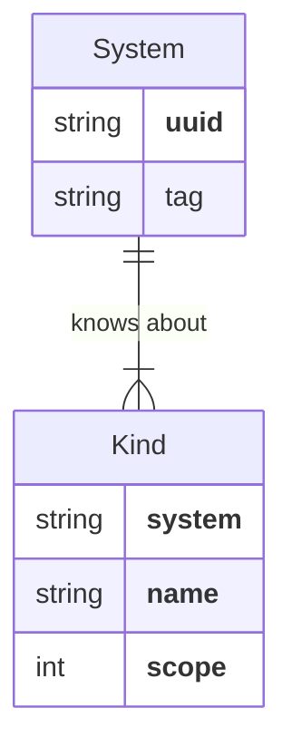
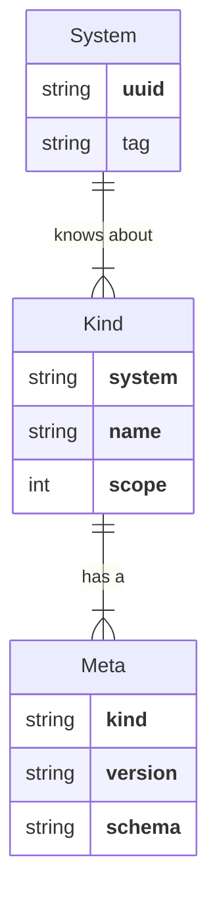
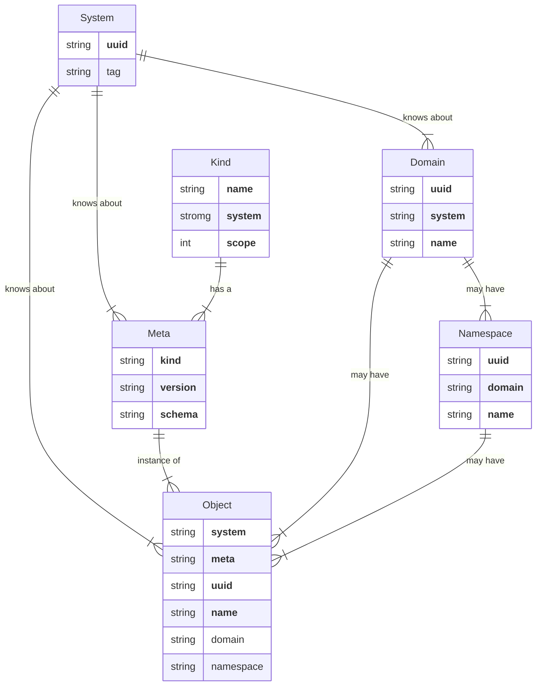

# Reference

This document contains the definition of terms and types in `rxp`.

## Scope

Scope refers to the *extent to which Names of instances of a Type of thing are
unique*. There are four scopes, shown here in decreasing order of breadth.

```mermaid
flowchart TD
    subgraph Global
        subgraph System
            subgraph Domain
                subgraph Namespace
```

All data managed by `rxp` is *scoped* to a `System`, `Domain` or `Namespace`.

A `System` represents the universe of known data for an installation of `rxp`.
A `Domain` is a logical division of a `System`. Likewise, a `Namespace` is a
logical division of a `Domain`.

## System

`System` represents the known boundaries of an `rxp` installation.

## Domain

`Domain` is a logical division of a `System`.

Each `Domain` has the following methods:

always have a UUID globally-unique identifier.

`Domains` always have a `Name` which is a specialized string type `DomainName`.

A valid `DomainName` is a DNS-formatted (RFC 1035-compliant) name less than 254
characters.

A `Domain`'s `Name` must be unique within the scope of the `Domain`'s `System`.

## `Namespace`

`Namespace` describes a logical division within a `Domain`.

A `Namespace` is typically used to segregate data by tenancy boundaries.

`Namespaces` always have a UUID globally-unique identifier.

`Namespaces` always have a `Name` which is a specialized string type
`NamespaceName`.

A valid `NamespaceName` is a DNS-formatted (RFC 1035-compliant) name.

Note that unlike RFC 1035, there is no 253 character size limit on
`NamespaceName` string length.

A `Namespace`'s `Name` must be unique within its containing `Domain`.

Briefly, a `Kind` identifies a *type* of a thing that is managed by `rxp`. A
`Kind` has a [`Name`][kindname] and a [`Scope`](#scope).

`Kinds` always have a [`System`](#system) identifier. System identifiers are
globally-unique.

[kindname]: https://github.com/relexec/rxp/blob/b5c989b0a587961dfaecf441c84dff58452fcbff/types/kind.go#L12-L60



A `KindVersion` is a **string** that uniquely identifies a *type and version*
of a thing that is managed by `rxp`.

A `Meta` contains the definition for a `KindVersion`. This definition includes
a `Schema` that defines the fields that comprise desired state for things of
that `KindVersion`.



An `Object` is an *instance* of a `KindVersion`.

`Objects` always have a `System` identifier.

`Objects` always have a UUID globally-unique identifier.

`Objects` always have a Name. An `Object`'s Name is unique within the
`Scope` associated with the `Kind`.

If that `Scope` is `ScopeNamespace` or `ScopeDomain`, the `Object`
is guaranteed to have a [`Domain`](#domain). If that `Scope` is
`ScopeNamespace`, the `Object` is guaranteed to have a
[`Namespace`](#namespace).

`Objects` may have zero or more `Labels` associated with them. `Labels` are
structures with a `Key` and optional `Value` that can be used to categorize
`Objects` and filter them in list operations.



## `Kind`

[`Kind`][kind] is a specialized string containing the *type* of an `Object`.

A valid `Kind` is a DNS-formatted (RFC 1035-compliant) name of the type of
`Object`, e.g.  `flow.temporal.io`.

Conventionally, a `Kind` is specified as a singular, not plural, noun. So,
`flow`, not `flows`.

Furthermore, a `Kind` is conventionally all lower-cased, with dots separating
coarser-grained categories/groups. So, `flow.temporal.io`, not
`TemporalFlow`.

You can use only alphanumeric characters and hyphens in the `Kind` name parts,
separated by periods. Furthermore, the first character of the `Kind` must be a
letter or number, not a hyphen or period.

> Note that unlike RFC 1035, there is no 253 character size limit on the
> `Kind` string length.

A `Kind` must be unique within the scope of the `rxp` system installation,
however for any `Kind` that is intended to be used across multiple `rxp` system
installations, the `Kind` should be globally-unique.

[kind]: https://github.com/relexec/rxp/blob/main/types/kind.go

## `KindVersion`

[`KindVersion`][kindversion] is a specialized string that contains the `Kind`
and optionally a SemVer version string that uniquely identifies the exact type
of an `Object`.

A `KindVersion` string has the format `<kind>[@<version>]`, where `<kind>` is a
valid `Kind` and the optional `<version>` component must be a valid SemVer
version string.

> Note that a valid SemVer version string does *not* contain a `v` prefix.

[kindversion]: https://github.com/relexec/rxp/blob/main/types/kindversion.go

## `Scope`

`Scope` refers to the uniqueness constraint applied to the name of some
thing managed by `rxp`.

There are three `Scope` values, listed here in order of specificity, from
the narrowest to broadest specificity.

* `ScopeNamespace`: name is unique within the scope of the `Object`'s
  `System`, `Kind`, `Domain`, and `Namespace`.
* `ScopeDomain`: name is unique within the scope of the `Object`'s
  `System`, Kind` and `Domain`.
* `ScopeSystem`: name is unique within the scope of the `Object`'s `System`
  and `Kind`.

## `Object`

[`Object`][object] describes an *instance* of something whose lifecycle is
controlled by `rxp`.

An `Object`'s lifecycle encompasses its creation, mutation and deletion.

`Object` has the following methods:

* `System()`: returns the `System` to which the the `Meta` is known.
* `KindVersion()`: returns a unique identifier for the type and version of the
  Object.
* `UUID()`: returns the globally-unique identifier.
* `Domain()`: returns the optional `Domain`.
* `Namespace()`: returns the optional intra-`Domain` `Namespace`.
* `Name()`: returns the human-readable name.
* `Labels()`: returns the optional collection of `Label`s.
* `Generation()`: returns the number of times the `Object`'s desired state has
  changed.
* `Spec()`: returns the desired state.

When an `Object` is read, it will always have a non-zero `Generation` value.
The `Generation` represents the number of times that the desired state of the
`Object` (its `Spec` has been mutated).

[object]: https://github.com/relexec/rxp/blob/main/types/object.go

## `Meta`

`Meta` contains metadata about a versioned type of `Object`.

`Meta` has the following methods:

* `System()`: returns the `System` to which the the `Meta` is known.
* `KindVersion()`: returns the `KindVersion`
* `Version()`: returns the [`semver.Version`][semver-version] struct indicating
  the Semantic Version of the `Kind` of `Object` the `Meta` defines.
* `Scope()`: returns the `Scope` uniqueness constraint.
* `Schema()`: returns the [jsonschema.Schema][jsonschema-schema] describing the
  field composition of desired state.
* `SchemaJSON()`: returns a string representation of the `Schema`

When the definition of a `Kind` of `Object` changes, the `Version` is
incremented, allowing for the controlled evolution of the schema and definition
of a `Kind`.

[semver-version]: https://pkg.go.dev/github.com/Masterminds/semver/v3#Version
[jsonschema-schema]: https://github.com/google/jsonschema-go/blob/main/jsonschema/schema.go

## `Spec`

`Spec` represents the *desired state* of an `Object`.

The fields that comprise a `Spec` are defined in the `Meta`'s `Schema`.

