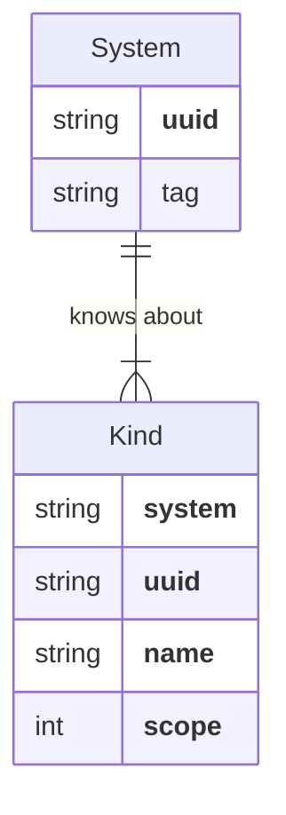
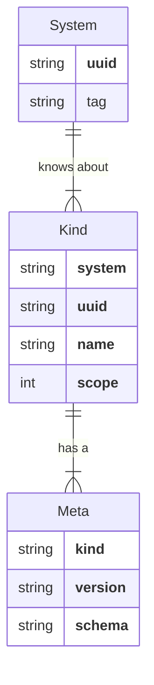
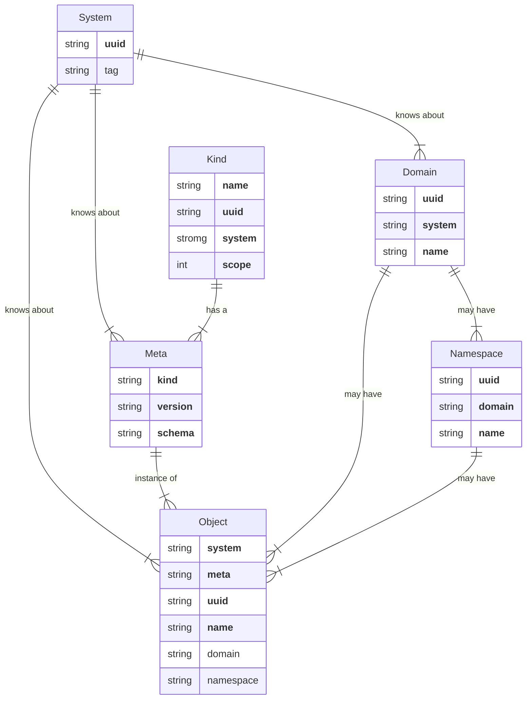

# Reference

This document contains the definition of terms and types in `rxp`.

## Scope

Scope* refers to the *extent to which Names of instances of a Type of thing are
unique*. There are four scopes, shown here in decreasing order of breadth.

```mermaid
flowchart TD
    subgraph Global
        subgraph System
            subgraph Domain
                subgraph Namespace
```

All data managed by `rxp` is *scoped* to a System, Domain or Namespace.

A System represents the universe of known data for an installation of `rxp`.
A Domain is a logical division of a System. Likewise, a Namespace is a
logical division of a Domain.

## System

*System* represents the known boundaries of an `rxp` installation.

## Domain

*Domain* is a logical division of a System.

Each Domain has a UUID globally-unique identifier.

Domains always have a `Name` which is a specialized string type DomainName.

A Domain's `Name` must be unique within the scope of the Domain's System.

### DomainName

A valid DomainName is a DNS-formatted (RFC 1035-compliant) name less than 254
characters.

## Namespace

*Namespace* describes a logical division within a Domain.

A Namespace is typically used to segregate data by tenancy boundaries.

Each Namespace has a UUID globally-unique identifier.

Namespaces always have a `Name` which is a specialized string type
`NamespaceName`.

A valid `NamespaceName` is a DNS-formatted (RFC 1035-compliant) name.

Note that unlike RFC 1035, there is no 253 character size limit on
`NamespaceName` string length.

A Namespace's `Name` must be unique within its containing Domain.

## Kind

*Kind* identifies a *type* of Object. 

Each Kind has a UUID globally-unique identifier.

Kinds always have a `Name` which is a specialized string type KindName.

Kinds always have a  `Scope` which indicates the uniqueness constraint for
names of Objects with that Kind.



### KindName

*KindName* is a specialized string containing the *type* of an Object.

A valid KindName is a DNS-formatted (RFC 1035-compliant) name of the type of
Object, e.g.  `flow.temporal.io`.

Conventionally, a KindName is specified as a singular, not plural, noun. So,
`flow`, not `flows`.

Furthermore, a KindName is conventionally all lower-cased, with dots separating
coarser-grained categories/groups. So, `flow.temporal.io`, not `TemporalFlow`.

You can use only alphanumeric characters and hyphens in the KindName parts,
separated by periods. Furthermore, the first character of the `Kind` must be a
letter or number, not a hyphen or period.

> Note that unlike RFC 1035, there is no 253 character size limit on the
> KindName string length.

A KindName must be unique within the scope of the `rxp` system installation,
however for any KindName that is intended to be used across multiple `rxp`
system installations, the KindName should be globally-unique.

### KindVersion

*KindVersion* is a **string** that uniquely identifies a specific version of
the Kind of an Object.

KindVersion a specialized string that contains the KindName and optionally a
SemVer version string that uniquely identifies the exact type of an Object.

A KindVersion has the format `<kind>[@<version>]`, where `<kind>` is a valid
KindName and the optional `<version>` component must be a valid SemVer version
string.

> Note that a valid SemVer version string does *not* contain a `v` prefix.

## Meta

*Meta* contains the definition for a KindVersion. This definition includes
a `Schema` that defines the fields that comprise desired state for things of
that KindVersion.



## Object

*Object* is an *instance* of a KindVersion.

Each Object has a UUID globally-unique identifier.

Objects have a `Name`. An Object's `Name` is unique within the
Scope associated with the Object's Kind.

If that Scope is `ScopeNamespace` or `ScopeDomain`, the Object is guaranteed to
have a [Domain](#domain). If that Scope is `ScopeNamespace`, the `Object` is
guaranteed to have a [Namespace](#namespace).

Objects may have zero or more `Labels` associated with them. `Labels` are
structures with a `Key` and optional `Value` that can be used to categorize
Objects and filter them in query operations.


