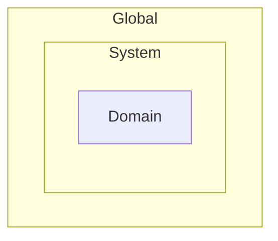

This document contains the definition of terms and types in `rxp`.

# Type

*Type* is the category of thing managed by `rxp`.

`rxp` defines the following Types:

* [System](#system)
* [Domain](#domain)
* [Kind](#kind)
* [KindVersion](#kindversion)
* [Object](#object)
* [Run](#run)

# Scope

*Scope* refers to the *extent to which Names of instances of a Type of thing are
unique*. There are three scopes, shown here in decreasing order of breadth.

```mermaid
flowchart TD
    subgraph Global
        subgraph System
            Domain
        end
    end
```

All data managed by `rxp` is *scoped* to a [System](#system) or a
[Domain](#domain).

A System represents the universe of known data for an installation of `rxp`.

A Domain is a logical division of a System. A Domain can have a parent Domain
allowing hierarchical relationships for these divisions.

# System

*System* represents the known boundaries of an `rxp` installation.

# Domain

*Domain* is a logical division of a System.

Each Domain has a UUID globally-unique identifier.

Domains always have a Name which is a specialized string type
[DomainName](#domainname).

A DomainName must be unique within the scope of the Domain's System.

A Domain can have a *parent* Domain.

## DomainName

A valid DomainName is a DNS-formatted (RFC 1035-compliant) name less than 254
characters.

# Kind

*Kind* identifies a type of [Object](#object). 

Each Kind has a UUID globally-unique identifier.

Kinds always have a Name which is a specialized string type
[KindName](#kindname).

Kinds always have a  [Scope](#scope) which indicates the uniqueness constraint
for names of Objects with that Kind.

## KindName

*KindName* is a specialized string containing the type of an [Object](#object).

A valid KindName is a DNS-formatted (RFC 1035-compliant) name of the type of
Object, e.g.  `runnable.temporal.io`.

Conventionally, a KindName is specified as a singular, not plural, noun. So,
`runnable`, not `runnables`.

Furthermore, a KindName is conventionally all lower-cased, with dots separating
coarser-grained categories/groups. So, `runnable.temporal.io`, not
`TemporalRunnable`.

You can use only alphanumeric characters and hyphens in the KindName parts,
separated by periods. Furthermore, the first character of the Kind must be a
letter or number, not a hyphen or period.

> Note that unlike RFC 1035, there is no 253 character size limit on the
> KindName string length.

A KindName must be unique within the scope of the `rxp` system installation,
however for any KindName that is intended to be used across multiple `rxp`
system installations, the KindName should be globally-unique.

# KindVersion

*KindVersion* contains the definition for a specific version of a [Kind](#kind). This
definition includes a Schema that defines the fields that comprise desired
state for things of that KindVersion.

KindVersions can be identified by a specialized string type KindVersionName.

## KindVersionName

*KindVersionName* is a specialized string containing the KindName and SemVer
version string that uniquely identifies the exact type of an Object.

This string has the format `<kind>@<version>`, where `<kind>` is a valid
KindName and `<version>` is a valid SemVer version string.

> Note that a valid SemVer version string does *not* contain a `v` prefix.

# Object

Object represents a data model that has data access and mutation patterns
typical of a simple [control plane resource][cp].

An Object's data access pattern is **read-heavy**. Read operations
significantly outnumber write operations, often 100:1 or more. Read operations
are predominantly single-key, indexed lookups.

An Object's data mutation pattern is **single-writer friendly**. Updating an
Object's desired state is done using optimistic concurrency control.

An Object is an instance of a [KindVersion](#kindversion).

Each Object has a UUID globally-unique identifier.

Objects have a Name. An Object's Name is unique within the
[Scope](#scope) associated with the Object's [Kind](#kind).

If that Scope is `ScopeDomain`, the Object is guaranteed to have a
[Domain](#domain).

Objects may have zero or more [Labels](#label) associated with them.

[cp]: ../docs/control-and-data-plane.md#control-plane

# Label

*Labels* are structures with a key and optional value that can be used to
categorize [Objects](#object) and filter them in query operations.
